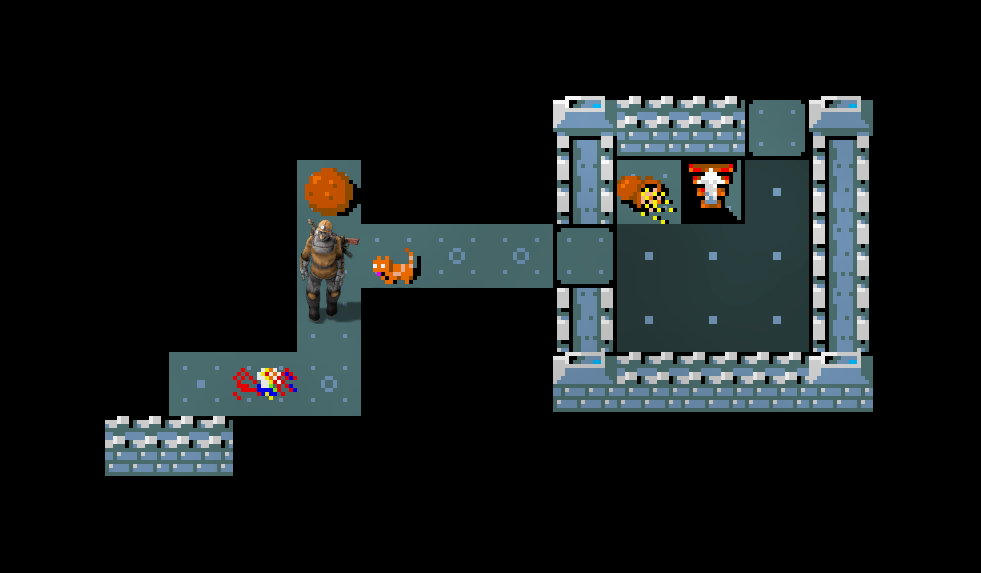
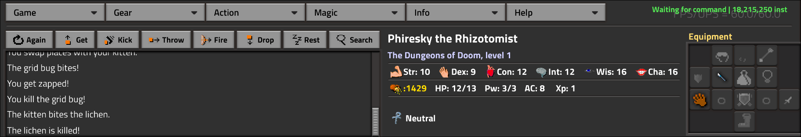

# NetHack in Factorio

Play the classic roguelike [NetHack](https://nethack.org/) inside [Factorio](https://factorio.com/).

Real NetHack 3.6.7 C code compiled to WebAssembly, interpreted by a **pure Lua WASM interpreter** running inside Factorio's modding sandbox. The Factorio game world is the display — every tile rendered as a Factorio entity with real NetHack pixel art. The NetHack world advances one tick when the player moves (or does an action).



## How it works

```
NetHack C source
    ↓  clang --target=wasm32-wasi
nethack.wasm (1.8 MB)
    ↓  embedded as Lua data
Pure Lua WASM interpreter (in Factorio's Lua 5.2 sandbox)
    ↓  imported functions bridge WASM ↔ Factorio
Factorio entities + GUI = the game display
```

The entire NetHack game logic runs unmodified — dungeon generation, combat, items, pets, shops, the whole thing. The interpreter executes ~475K WASM instructions per second, with an AOT compiler that boosts hot loops to ~2.8M inst/sec.

### The resumable state machine

Factorio's modding API is heavily restricted to enforce determinism for replays and multiplayer lockstep:

- No coroutines (disabled — they are hard to serialize)
- No threads
- No wall clocks or timers
- `on_tick` handlers must return quickly (<16ms)

But NetHack is a traditional blocking C program: it calls `nhgetch()` and waits for input.

The WASM interpreter solves this by running as a **resumable state machine**. It executes a budget of instructions per tick, then saves its entire execution state (program counter, call stack, locals, operand stack) and yields back to Factorio. When the player provides input, execution resumes exactly where it left off.

Some WASM host imports are **blocking** (like `nhgetch` — wait for a keypress, or `select_menu` — wait for menu selection) and some are **non-blocking** (like `print_glyph` — draw a tile, or `putstr` — display a message). When the interpreter hits a blocking import, it pauses execution and sets up the appropriate GUI. The player's next input feeds back through the bridge, the return value is pushed onto the WASM stack, and interpretation continues.

This means NetHack's deeply nested C call stack (e.g. `allmain → moveloop → rhack → dokick → kick_monster → ...`) stays frozen in the interpreter's state between ticks, without any OS-level threading or Lua coroutines.

Without wall clocks, the instruction budget per tick is a fixed constant - it can't adapt based on how long execution actually took. Too high and the game stutters; too low and NetHack feels sluggish. The AOT compiler and peephole optimizer exist largely to make each budgeted instruction cheaper, squeezing more NetHack progress into the same fixed tick budget.

<!-- TODO: screenshot of the GUI (status pane, inventory, messages) -->

## Features

- Full NetHack 3.6.7 gameplay
- UI layout based on the original Qt GUI layout
- Original NetHack tile art (monsters, objects, dungeon features), plus switchable ASCII Mode
- Equipment paperdoll display
- Synchronization with Factorio inventory
- Status pane with HP/MP bars, stats, and tooltips
- Save/load persisted through Factorio's save system (+ export save function)



## The WASM Interpreter

The heart of the project is a complete WebAssembly interpreter written in pure Lua 5.2, running inside Factorio's sandboxed modding environment. It supports:

- **Multi-value extension** — blocks with parameters and multiple return values
- **Exception handling** — `try_table`/`throw` for NetHack's setjmp/longjmp
- **WASI preview1** — virtual filesystem, clock, args, preopened directories
- **AOT compiler** — hot functions compiled to Lua source via `load()` for 2-4x speedup
- **Peephole optimizer** — 30+ fused instruction patterns
- **Full spec compliance** — all 9,944 WebAssembly spec tests pass

## Building

### Prerequisites (Arch Linux)

```bash
pacman -S clang wasi-libc wasi-compiler-rt binaryen oxipng \
          lib32-glibc lib32-gcc-libs lib32-ncurses python python-pillow
```

### Build

```bash
make          # full build (clone NetHack + host tools + WASM + sprites)
make wasm     # recompile WASM only
make sprites  # regenerate sprites only
make verify   # check all generated files exist
make clean    # remove all generated files
```

The build clones NetHack 3.6.7, builds 32-bit native host tools (makedefs, lev_comp, dgn_comp, tilemap), cross-compiles to WASM, generates Lua data modules, and converts tile art to Factorio sprite sheets.

### Install

For dev: Copy or symlink the mod directory into your Factorio mods folder:

```bash
ln -s "$(pwd)" ~/.factorio/mods/nethack-factorio
```

Otherwise, get this mod from https://mods.factorio.com/mod/nethack

### Testing WASM

```bash
./build/run_tests.sh              # full test suite
./build/run_tests.sh --unit-only  # unit tests only
./build/run_tests.sh --spec-only  # spec tests only
lua5.2 build/test_wasm.lua        # 56 unit tests
lua5.2 build/test_play.lua        # end-to-end NetHack playtest + benchmark
```

**Note:** Use `lua5.2`, not `lua` — system Lua may be 5.4 which lacks the `bit32` library and has other incompatible changes.

## Project Structure

```
scripts/
  wasm/
    init.lua          WASM binary parser
    interp.lua        Interpreter core (~175 opcodes, EH, state machine)
    memory.lua        Linear memory implementation
    compiler.lua      AOT compiler (WASM → Lua source)
    wasi.lua          WASI runtime (VFS, clock, args)
  bridge.lua          WASM ↔ Factorio API bridge
  display.lua         Tile rendering (entities + sprite sheets)
  input.lua           Player movement → WASM input
  gui.lua             GUI coordinator
  gui_status.lua      Status pane (stats, HP bars, paperdoll)
  gui_menus.lua       Menu/text windows
  gui_plsel.lua       Player selection UI

build/
  winfactorio.c       Factorio window port (C, compiled to WASM)
  sysfactorio.c       Platform main + system stubs
  wasm_to_lua.py      Converts .wasm → Lua string module
  embed_data.py       Packages data files → nethack_data.lua
  convert_tiles.py    Tile art → sprite sheets + ground tiles
  compile_wasm.lua    AOT compiler driver
  test_wasm.lua       Unit tests
  run_spec_tests.lua  Spec test runner

graphics/
  sheets/             Sprite sheet PNGs (generated)
  tiles/              Ground tile PNGs (generated)
```

## How the display works

NetHack's `print_glyph()` calls pass through the C window port as WASM host imports, which the Lua bridge translates into Factorio entity creation. Each map cell becomes a Factorio entity with its sprite selected from pre-generated sprite sheets containing all 1,500+ NetHack tiles (monsters, objects, and dungeon features).

The GUI (status lines, messages, menus, inventory) is built with Factorio's native GUI framework, updated by the same bridge imports.

## Acknowledgments

- [NetHack](https://nethack.org/) by the NetHack DevTeam
- [Factorio](https://factorio.com/) by Wube Software